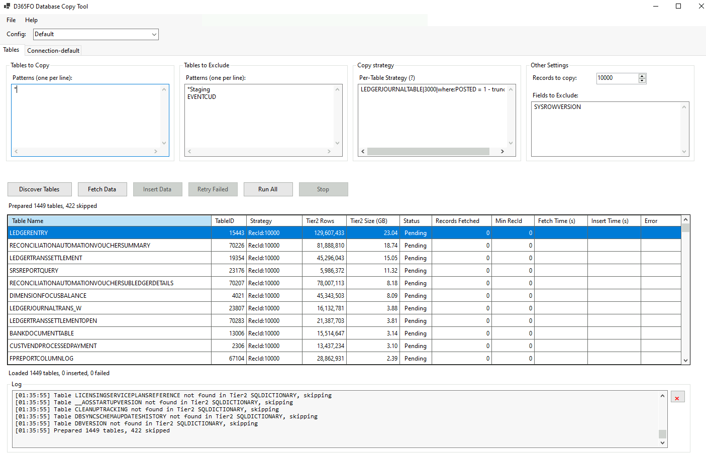

# D365FO Database Copy Tool

A WinForms .NET 9 application for copying data from Dynamics 365 Finance & Operations Azure SQL Database (Tier2) to local SQL Server (AxDB).

## Overview

This tool helps developers synchronize data from D365FO cloud environments to their local development databases, making it easier to test with production-like data.



## Features

### Core Functionality
- **Selective Table Copying**: Use patterns to include/exclude tables (e.g., `CUST*`, `Sys*`)
- **Simplified Copy Strategies**:
  - **RecId Strategy**: Copy top N records by RecId DESC (e.g., `CUSTTABLE|5000`)
  - **SQL Strategy**: Custom SQL queries with field and count placeholders (e.g., `CUSTTABLE|sql:SELECT * FROM CUSTTABLE WHERE DATAAREAID='USMF'`)
  - **Truncate Option**: Force TRUNCATE before insert with `-truncate` flag
- **SysRowVersion Optimization**: Intelligent change detection for incremental sync
  - **INCREMENTAL Mode**: Only sync changed records when changes < 40% threshold
  - **TRUNCATE Mode**: Full table refresh when changes > 40% threshold
  - **Timestamp Tracking**: Automatic persistence of sync state for future optimizations
- **Smart Field Mapping**: Automatically maps common fields between source and destination
- **Parallel Execution**: Configurable parallel workers (1-50) for concurrent table processing
- **Delta Comparison**: Smart comparison using RECVERSION + datetime fields to skip unchanged records

### Strategy Syntax

Simplified pipe-delimited format:

```
TableName|RecordCount|sql:CustomQuery -truncate
```

**RecId Strategy Examples:**
```
CUSTTABLE                    # Use default record count
SALESLINE|10000              # Top 10000 records by RecId DESC
```

**SQL Strategy Examples:**
```
# SQL without explicit count (uses default)
INVENTTRANS|sql:SELECT * FROM INVENTTRANS WHERE DATAAREAID='USMF'

# SQL with explicit count
CUSTTRANS|5000|sql:SELECT TOP (@recordCount) * FROM CUSTTRANS WHERE BLOCKED=0

# SQL with truncate
VENDTABLE|5000|sql:SELECT * FROM VENDTABLE WHERE POSTED=1 -truncate
```

**SQL Placeholders:**
- `*` - Replaced with actual field list (only common fields between Tier2 and AxDB)
- `@recordCount` - Replaced with record count (default or explicitly specified)
- `@sysRowVersionFilter` - Replaced with `SysRowVersion >= @Threshold AND RecId >= @MinRecId`
  - **Required for SQL strategies to enable INCREMENTAL mode optimization**
  - If missing, SQL strategies will fall back to standard mode (delta comparison or TRUNCATE based on normal logic)

**Examples with optimization:**
```
INVENTDIM|50000|sql:SELECT * FROM INVENTDIM WHERE DATAAREAID='1000' AND @sysRowVersionFilter ORDER BY RecId DESC
CUSTTRANS|5000|sql:SELECT TOP (@recordCount) * FROM CUSTTRANS WHERE BLOCKED=0 AND @sysRowVersionFilter
```

### SysRowVersion Optimization

For tables with `SysRowVersion` column, the tool uses intelligent optimization:

**First Run:**
- Standard mode with delta comparison
- Saves Tier2 and AxDB timestamps after successful sync
- Smart TRUNCATE detection: If AxDB has excess records (> 40% more than syncing), auto-enables TRUNCATE mode

**Subsequent Runs:**
- **Control Query**: Fetches only RecId + SysRowVersion (~1KB per 1000 records vs ~100MB for full data)
- **Change Detection**: Compares timestamps to calculate change percentage
- **Mode Selection**:
  - **INCREMENTAL Mode** (changes < 40%): 3-step incremental delete + selective insert
  - **TRUNCATE Mode** (changes > 40%): Full table refresh

**Benefits:**
- 99%+ reduction in data transfer when no changes detected
- 20x+ faster sync for tables with minimal changes
- Automatic fallback to full refresh when needed
- Timestamps auto-saved after each table (crash-safe)

### User Interface
- **Configuration Management**: Save and load multiple connection configurations
- **System Excluded Tables**: Separate management for system-level exclusions (SQL*, Sys*, Batch*, etc.)
- **Optimization Settings**:
  - **Truncate Threshold**: Configurable percentage threshold (default: 40%)
  - **Timestamp Tracking**: View and manage stored timestamps per table
  - **Clear Timestamps**: Reset optimization state for fresh sync
- **Real-time Progress**: Monitor fetch/insert progress for each table
- **Sortable Grid**: Click column headers to sort
- **Context Menu**: Right-click to copy table names or generate SQL for testing
- **Get SQL Feature**: Preview all SQL operations (source query, cleanup, insert, sequence) without execution
- **Detailed Logging**: All SQL operations logged with timestamps
- **Menu System**: File menu (Save, Load, Exit) and Help menu (About)

### Technical Features
- **SQLDICTIONARY Caching**: Loads metadata once at startup for 10-20x speedup
- **Automatic Sequence Updates**: Updates D365FO sequence tables after insert
- **Trigger Management**: Disables during insert, re-enables after (even on error)
- **Bulk Insert**: SqlBulkCopy with 10,000 row batches for performance
- **Transaction-based Operations**: Rollback on errors with proper cleanup
- **Connection Pooling**: Optimized for parallel execution (Max Pool Size=20)
- **Memory Efficient**: Only N tables in memory at once (where N = parallel workers)
- **Context-aware Cleanup**: Smart delete logic based on strategy and optimization mode

## Requirements

- Windows OS
- .NET 9.0 Runtime
- SQL Server 2019+ (for local AxDB)
- Access to D365FO Azure SQL Database (Tier2)

## Configuration

### Connection Settings
- **Tier2 (Azure SQL)**: Server, database, credentials, timeouts
- **AxDB (Local SQL)**: Server, database, credentials, timeouts
- **System Excluded Tables**: System-level table exclusions (managed separately from user exclusions)
- **Parallel Workers**: Number of concurrent table processing workers (default: 10, range: 1-50)

### Optimization Settings
- **Truncate Threshold**: Percentage threshold for TRUNCATE vs INCREMENTAL mode (default: 40%)
- **Tier2 Timestamps**: Stored SysRowVersion timestamps from Tier2 (auto-managed)
- **AxDB Timestamps**: Stored SysRowVersion timestamps from AxDB (auto-managed)

### Table Selection
- **Tables to Copy**: Patterns like `*`, `CUST*`, `SALES*` (one per line)
- **Tables to Exclude**: User-defined exclusions (default: `*Staging`)
- **System Excluded Tables**: System-level exclusions (default: `SQL*`, `UserInfo`, `Sys*`, `Batch*`, `RetailCDX*`, etc.)
- **Fields to Exclude**: Fields to skip globally or per-table (e.g., `SYSROWVERSION` or `CUSTTABLE.FIELDNAME`)

### Copy Strategies

**Default**: RecId strategy with configurable record count

**Per-Table Overrides**:
```
CUSTTABLE                                    # RecId: Default count
SALESLINE|10000                              # RecId: Top 10000
INVENTTRANS|sql:SELECT * FROM INVENTTRANS WHERE DATAAREAID='USMF'
CUSTTRANS|5000|sql:SELECT TOP (@recordCount) * FROM CUSTTRANS WHERE BLOCKED=0
VENDTABLE|5000 -truncate                     # Force truncate
```

## Usage

### Standard Workflow

1. **Configure Connections**: Set up Tier2 and AxDB connection details
2. **Configure Exclusions**: Set System Excluded Tables (Connection tab) and user exclusions (Tables tab)
3. **Select Tables**: Define inclusion/exclusion patterns
4. **Define Strategies**: Specify per-table copy strategies
5. **Discover Tables**: Discovers tables, validates schemas, loads SQLDICTIONARY cache
6. **Process Tables**: Processes all pending tables in parallel

Or use **Run All** to execute all steps sequentially.

### Single Table Processing

Use **Process Selected** to:
- Re-process a specific table with updated strategy
- Retry failed tables
- Test optimization on individual tables

### Get SQL Feature

Right-click on any table in the grid after "Discover Tables" to generate formatted SQL showing:
- Source query (Tier2)
- Cleanup queries (AxDB) - step by step with explanations
- Insert operation details
- Sequence update SQL

This allows you to test and verify SQL logic without running the actual operations.

### Optimization Workflow

**Initial Setup:**
1. Run sync normally - timestamps saved automatically after each table
2. Configuration auto-saves to disk after each table (crash-safe)

**Subsequent Syncs:**
1. Tool automatically detects timestamps for tables with SysRowVersion
2. Uses optimized mode (control query + smart delete/insert)
3. Dramatically faster when no/few changes detected

**Reset Optimization:**
- Use "Clear All Timestamps" button to reset optimization state
- Useful when you want to force full refresh

## Performance

### Expected Improvements (with SysRowVersion Optimization)

| Scenario | Standard Mode | Optimized Mode | Improvement |
|----------|---------------|----------------|-------------|
| No Changes (10K rows) | 30s, 100MB | 2s, 100KB | 15x faster, 1000x less data |
| 5% Changes (10K rows) | 30s, 100MB | 5s, 5MB | 6x faster, 20x less data |
| 50% Changes (10K rows) | 30s, 100MB | 25s, 90MB | Falls back to TRUNCATE mode |

*Actual results vary based on network, table structure, and data complexity*

## Author

**Denis Trunin**

- GitHub: https://github.com/TrudAX/
- Copyright © 2025 Denis Trunin

## License

MIT License - See LICENSE file for details

## Notes

- Configuration files stored in `Config/` directory (gitignored)
- Passwords obfuscated (not encrypted) using Base64
- Last used configuration tracked in `Config/.lastconfig`
- Timestamps auto-saved after each table completion
- Always test with non-production data first
- Ensure proper database permissions before running
- Large tables may take significant time on first run (subsequent runs optimized)
- SQL queries in SQL strategy are passed directly to SQL Server - ensure proper formatting
- System Excluded Tables are combined with user-defined exclusions during execution
- For best performance, use parallel workers = number of CPU cores (default: 10)
- Optimization threshold configurable per environment (default: 40%)
